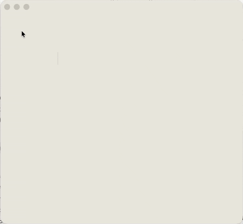

# Dissolve — Ephemeral Writing App



A meditative writing surface for macOS. Type, and your words crumble into a
GPU-simulated granular material — falling, piling, settling into structural
dunes. There is no save. There is no archive. The page is a sandbox for
transient thinking.

## What it does

- **Freeform canvas.** No text storage, no layout. Each keystroke rasterizes
  a glyph to particles at the caret. Click anywhere to drop the caret;
  backspace rewinds the carriage but leaves the ink.
- **Bottom-up decay.** Letters hold solid for most of the configured decay
  time, then collapse — bottom row first, accelerating upward — into a
  curtain of ash.
- **Real granular physics.** Position-based-dynamics solver with Coulomb
  friction. Angle-of-repose, compaction, and avalanches emerge from the
  contact model — not from per-axis hacks.
- **Sleep & wake.** Settled grains stop integrating, so piles are perfectly
  still (with only a microscopic shimmer). Removing support — e.g. when an
  underlying letter dissolves out — wakes the grains above so they fall.
- **Cursor brush.** Move the mouse through falling mist or a settled dune
  and the grains drift with the velocity of your gesture.
- **TNT.** Type the literal sequence `TNT` to lock those three letters in
  place and light a 3-second fuse. Detonation vaporizes them and blasts
  any nearby ash. Multiple TNTs can be armed at once; if one explosion's
  blast radius reaches another armed TNT, that one chains immediately.

## Settings

Open the Settings window (⌘,) for:

- **Font** — picker, live-rendered in each face, populated from system
  font families.
- **Size** — 14–60pt.
- **Decay** — how long a letter holds before crumbling, 3 s to 2 min.
- **Surface** — background and ink color pickers.

## Build

The Xcode project is generated from `project.yml` via
[XcodeGen](https://github.com/yonsm/XcodeGen):

```bash
brew install xcodegen
cd Dissolve_git
xcodegen generate
open Dissolve.xcodeproj
```

Then build/run with ⌘R. The `Dissolve.xcodeproj` directory is regenerated
from `project.yml` and is intentionally not checked in.

## Tech

- Swift, SwiftUI, AppKit, Metal, simd.
- Custom GPU PBD solver (4 substeps, Jacobi position correction with
  Coulomb friction, spatial-hash grid).
- macOS 14+, Apple silicon recommended.

## License

Personal project. Use at your own discretion.
